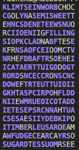

# Word Search Puzzle Solver

A command-line tool that reads a word-search puzzle grid and a list of words, finds the words in the grid, and outputs a colour-marked solved puzzle.

### Features
- Reads a puzzle grid from a file or from standard input
- Reads words to search for from standard input
- Marks all occurrences of found words
- Prints the solved, coloured puzzle
- Provides a --help flag explaining usage

### Usage

###### Run with a puzzle file
```
/wordsearch puzzle.txt
```

###### Run using standard input
```
./wordsearch
```

Then type/paste the puzzle, followed by a line containing:
```
=
```

After that, type each word to search for, one per line.
Press Ctrl-D to finish and print the solved puzzle.

### Command-Line Options

Option	            Description
--help	            Prints program information and exits

### Input Format

###### Puzzle Grid
- A rectangular grid of characters
- Read from the given file or from stdin
- Ends when file ends (or when the user types = in stdin mode)

###### Words
- Always read from standard input
- One word per line
- Reading stops at EOF (Ctrl-D)

### Output

The program prints the solved puzzle, with each character marked according to whether it belongs to a found word.
Coloring logic is implemented in:
```
output.c
output.h
```

### Code Overview
###### Main Components
File	                        Purpose
main.c	                        Program entry point, CLI handling
read.c / read.h	                Reads puzzle grid into memory
copy.c / copy.h	                Memory allocation helpers
find.c / find.h	                Word search logic
output.c / output.h	            Prints coloured solved puzzle
errors.c / errors.h	            Error-handling utilities

### Compile Instructions
Using GCC:
```
gcc -o wordsearch main.c read.c copy.c find.c output.c errors.c
```

Or, if a Makefile is provided:
```
make
```

### Example
###### Input Puzzle
```
CAT
DOG
RAT
```

###### Words Typed Into Standard Input
```
CAT
RAT
DOG
```

Press Ctrl-D to print the solved puzzle.

###### Example Solved Puzzle Output


### Author

Raadhikka Gupta
SFWRENG 2XC3
November 2025